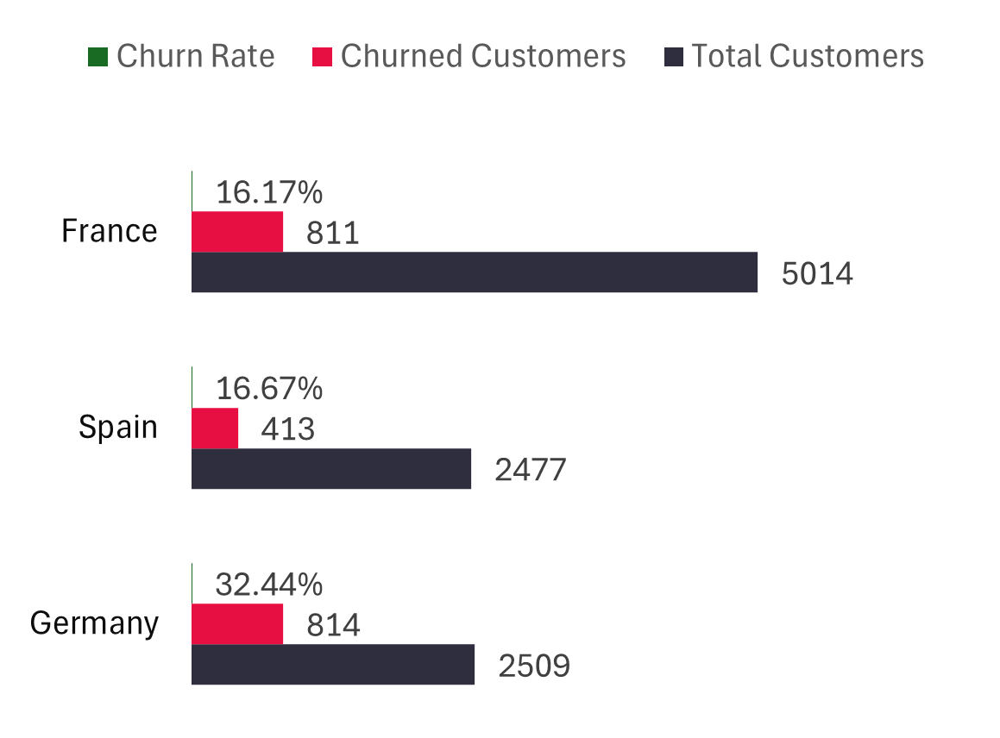
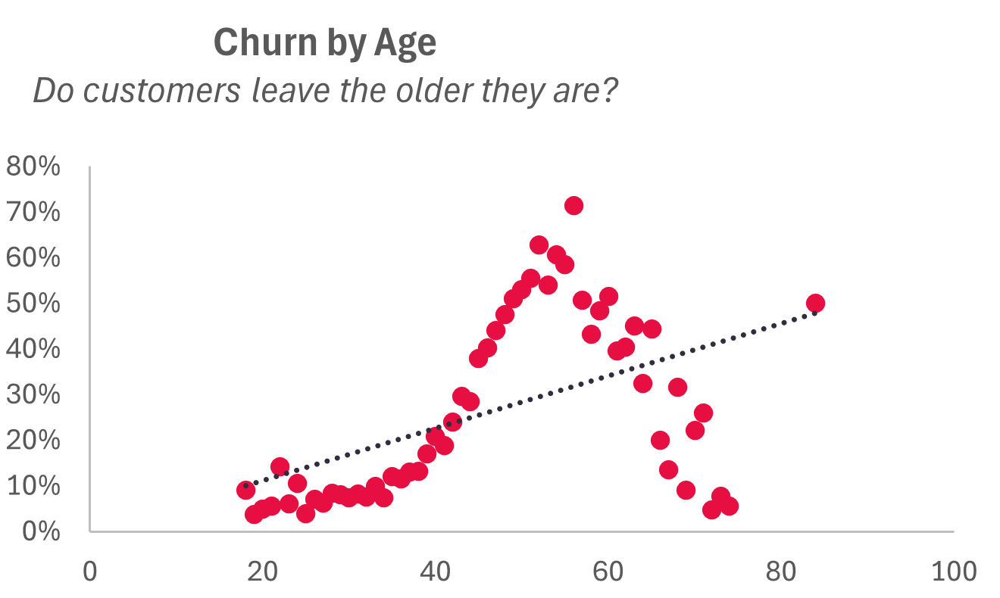
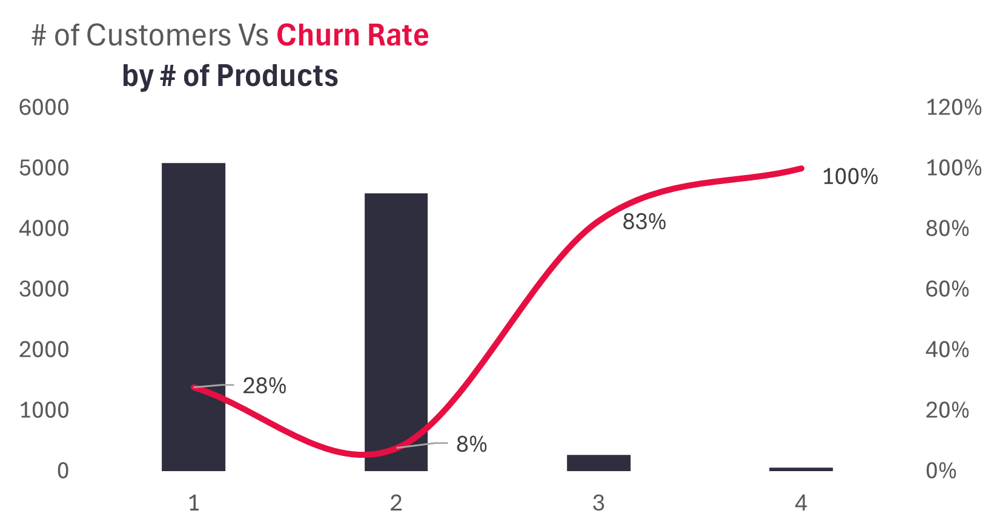

# Bank Customer Churn Analysis Using Microsoft Excel

## 📌 Project Overview
This project investigates the reasons behind customer churn in a commercial bank. Over recent months, a significant number of customers have been closing their accounts, and the bank seeks to understand why.  

Using a dataset of **9,992 records and 18 variables**, I analyzed customer demographics, financial attributes, and product engagement to uncover the main drivers of churn. The analysis was done fully in **Microsoft Excel**, with the aim of providing actionable insights that can help the bank strengthen its retention strategies.

---

## 📊 Dataset
- **Source:** Microsoft Excel file  
- **Size:** 9,992 records, 18 fields  
- **Key Variables:**
  - `CustomerId` – Unique ID for each customer  
  - `CreditScore` – Credit score of the customer  
  - `Geography` – Customer’s country (France, Spain, Germany)  
  - `Gender` – Male/Female  
  - `Age` – Age of customer (numeric, grouped into categories)  
  - `Tenure` – Years spent with the bank  
  - `Balance` – Account balance  
  - `NumOfProducts` – Number of products owned  
  - `HasCrCard` – Whether the customer has a credit card (1 = Yes, 0 = No)  
  - `IsActiveMember` – Active membership status (1 = Yes, 0 = No)  
  - `Satisfaction Score` – Rating (1–5)  
  - `Exited` – Whether the customer churned (1 = Yes, 0 = No)  

---

## 🛠 Tools and Skills Used
- **Excel Features:** PivotTables, PivotCharts, Conditional Formatting  
- **Functions:** XLOOKUP, INDEX-MATCH, Text Functions, CORREL  
- **Data Cleaning:** Removed duplicates, standardized formats, created `AgeGroup` feature  
- **Visualization:** Dashboards and charts to explore churn trends  

---

## 🔎 Methodology
1. **Data Cleaning and Preparation**  
   - Checked for missing values and duplicates  
   - Standardized binary columns (1 = Yes, 0 = No)  
   - Created `AgeGroup` (Young, Middle-aged, Old, Very Old)

2. **Exploratory Data Analysis (EDA)**  
   - Used PivotTables and PivotCharts to explore churn across demographics and engagement  
   - Applied correlation analysis (CORREL) to test numeric variable relationships  
   - Used conditional formatting to flag high churn-risk customers  

3. **Visualization & Dashboard**  
   - Designed an Excel dashboard summarizing churn insights by geography, age, satisfaction score, products, and activity status.  

---

## 📈 Key Findings
- **Age & Churn:** Older customers (especially middle-aged and very old) were more likely to churn.  
- **Geography:** Germany had the highest churn rate (32%), compared to Spain (16%) and France (14%).  
- **Balance:** Customers with higher balances were surprisingly more likely to leave.  
- **Products:** Customers with 3–4 products showed very high churn (83–100%).  
- **Complaints:** Customers who lodged complaints churned at much higher rates.  
- **Card Type:** Diamond cardholders churned more than Gold cardholders.  

---

## 💡 Recommendations
1. **Retention Programs for Older & High-Balance Customers**  
   - Loyalty perks, premium support, or dedicated relationship managers.  

2. **Localized Strategy for Germany**  
   - Conduct surveys and improve localized services.  

3. **Reassess Premium Card Offerings**  
   - Improve Diamond card value (rewards, benefits, exclusivity).  

4. **Improve Complaint Resolution Systems**  
   - Faster resolution, proactive follow-ups, and stronger customer support.  

5. **Engage New Customers Early**  
   - Onboarding programs, personalized offers, and early engagement.  

---

## 📊 Dashboard Preview
Here are some visual insights from the analysis:

  
  
  

*(Add your actual chart screenshots in the `/images` folder and update the file names above.)*

---

## 📚 Conclusion
The analysis revealed that **age, geography, account balance, product type, and complaints** are the strongest churn drivers.  

By implementing targeted retention strategies—such as loyalty programs, localized actions, improved complaint handling, and product reassessment—the bank can significantly reduce churn and retain its most valuable customers.  

Future work could involve extending this analysis with **Power BI or Python-based predictive models** for real-time churn prediction.  

---

## 👤 Author
**Abdulrazak Jubril Iyamah**  
Professional Diploma in Data Analytics – IDEAS Program, Baze University Abuja  

🔗 [LinkedIn](#) | [GitHub](#)

---
